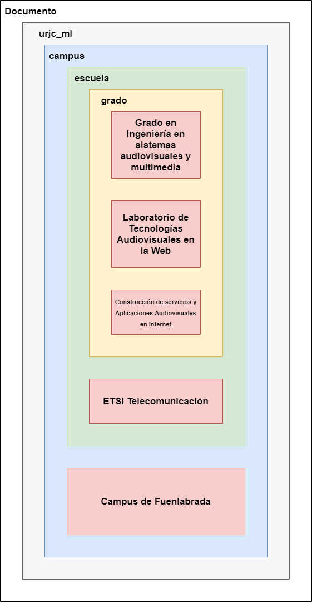
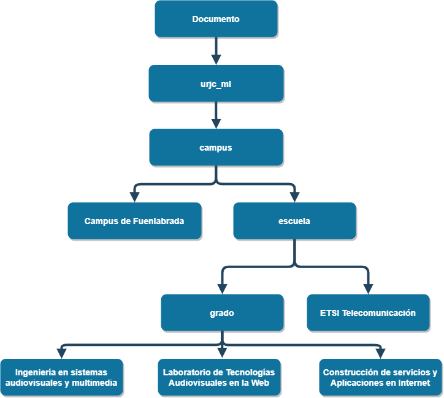

# Ejercicio 1

### Dado este documento descrito en SGML, usando el tipo de documento urjc_ml definido en el fichero urjc_ml.dtd

```
<!DOCTYPE urjc_ML SYSTEM "urjc_ml.dtd">
<urjc_ml>
  <!-- include URL URJC -->
  <campus>
    <nombre>Campus de Fuenlabrada</nombre>
    <escuela>
      <nombre>ETSI Telecomunicación</nombre>
      <grado>
        <nombre>Ingeniería en Sistemas Audiovisuales y Multimedia </nombre>
        <asignatura>Laboratorio de Tecnologias Audiovisuales en la Web</asignatura>
        <asignatura>Construcción de servicios y Aplicaciones Audiovisuales en Internet</asignatura>
      </grado>
    </escuela>
  </campus>
</urjc_ml>
```

**a) Explica para qué sirve la primera línea del documento y por qué es necesaria**   
    *Sirve para indicar al ficehro dónde está la deficinión de lenguaje que vamos a utilizar.*

**b) Si se omitiese esta línea, ¿Qué piensas que ocurriría?**  
    *No sabríamos de que tipo de documento se trata y daría un error. *

**c) Sin conocer el contenido del fichero urjc_ml.dtd, ¿el documento es sintácticamente correcto?**  
    *Sin conocer el contenido no podemos asumir que es correcto. *

**d) ¿Qué hace la tercera línea?**  
*La tercera línea es un comentario, no afectaría al código.*

**e) ¿Cuantas etiquetas de apertura hay? ¿Cuantas de cierre?**  
*Hay 9 etiquetas de apertura y 9 de cierre.*

**f) Dibuja el diagrama de contenedores de este documento**  
  

**g) Dibuja la estructura en árbol que define este documento**  
  


# Ejercicio 2
### Este arbol representa la estructura del tipo de documento universidad, que está definido en el archivo llamado universidad.dtd. Los nombres de las etiquetas de cada elemento del árbol están escritos en los nodos. Estos nombres con válidos y se encuentra definidos dentro del documento DTD

**a) Escribe el documento en SGML que representa esa estructura**  
```
<!DOCTYPE universidad SYSTEM "universidad.dtd">
<universidad>
  <escuela>
      <nombre>ETSI Telecomunicación</nombre>
      <grado>
          <nombre>Ingeniería en Sistemas Audiovisuales y Multimedia</nombre>
          <asignatura>LTAW</asignatura>
          <asignatura>CSAAI</asignatura>
          <asignatura>ASA II</asignatura>
      </grado>
      <grado>
        <nombre>Ingeniería en Robótica Software</nombre>
        <asignatura>AC</asignatura>
      </grado>
  </escuela>
</universidad>
```